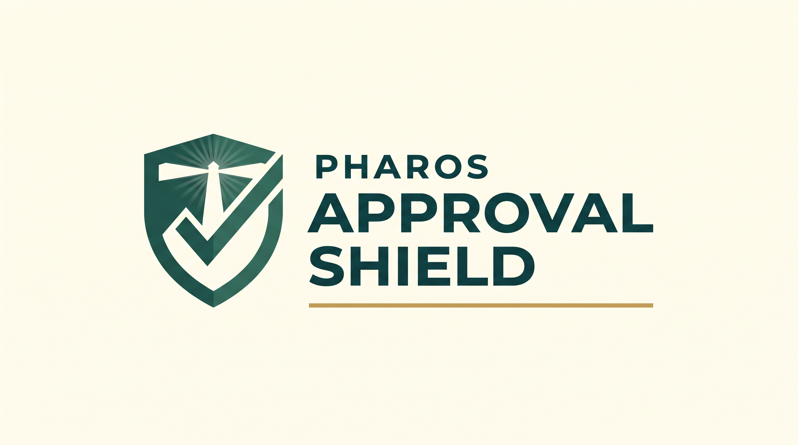

<div align="center">



**A defensive Skill for AI Agents operating on Pharos.**

[🌐 Live demo](https://bs7k2wt8a4re.space.minimax.io) · [📦 Source](.) · [🏆 Hackathon](https://dorahacks.io/hackathon/pharos-phase1)

</div>

---

A defensive **Skill** for AI Agents operating on Pharos. Audits ERC-20
allowances, Permit2 authorizations, ERC-721/1155 operator rights, and
recent phishing signatures — then returns a prioritized, risk-scored
report and a one-click revoke plan.

Built for the **Skill-to-Agent Dual Cascade Hackathon** on Pharos × Anvita
Flow (Phase 1: Skill Hackathon, June 8 – June 15, 2026).

---

## What problem does this solve?

When an AI Agent operates on a user's behalf, it needs to either:

1. Hold an `ERC-20.approve(agent, amount)` allowance, or
2. Use a Permit2 / off-chain signature that grants spend rights

But the **user** has to trust the agent with those permissions. Before any
agent can move value safely, both sides need to know:

- What approvals are already open?
- Which spenders are trusted (allowlist)?
- Are any of them *infinite* (drainer vector)?
- Did the wallet recently sign a phishing permit?
- What's the smallest, cheapest set of revokes that closes risk?

This Skill answers all of those questions, in one read-only pass.

## Why it's original

The official `pharos-skill-engine` ships a generic on-chain toolkit
(balance queries, contract reads, deploy, verify). It does **not** ship
anything for wallet safety, approval auditing, or phishing detection.

Existing work in this space (Revoke.cash, Pocket Universe, Blowfish) is
either browser-extension-based or paid SaaS — none of it is a
**composable Skill an Agent can call directly**.

This Skill is the only one (as of 2026-06-10) that:

- Targets the Pharos network specifically
- Wraps the official `pharos-skill-engine` RPC config (drop-in compatible)
- Returns a **machine-readable revoke plan** that Anvita Flow agents can
  consume directly in Phase 2
- Is **read-only by default** — the agent never signs without explicit
  user confirmation

## Quick start

```bash
# 1. Install Foundry
curl -L https://foundry.paradigm.xyz | bash && source ~/.zshenv && foundryup

# 2. Run a safety report (read-only, no key needed)
export TARGET_WALLET=0xYourWallet...
python3 scripts/scan.py --wallet "$TARGET_WALLET" --network atlantic-testnet

# 3. Generate a revoke plan
python3 scripts/scan.py --wallet "$TARGET_WALLET" --network atlantic-testnet \
  --emit-revoke-plan --out demo/wallet-report.json

# 4. (Optional) Execute the revokes
export PRIVATE_KEY=0x...
./scripts/execute-revoke.sh demo/wallet-report.json
```

See [demo/README.md](demo/README.md) for the full demo script.

## Architecture

```
SKILL.md                ← entry point, agent reads this first
references/             ← deep-dive docs the agent pulls in per task
assets/
  ├── networks.json         ← Pharos RPC config (matches pharos-skill-engine)
  ├── known-good-dapps.json ← spender allowlist
  └── risk-signatures.json  ← phishing selector patterns
scripts/
  ├── scan.py               ← main scanner
  └── execute-revoke.sh     ← revoke executor (user-confirmed, never auto)
demo/
  ├── README.md             ← demo video script
  └── sample-report.json    ← example output
```

## Capabilities (one-line summary)

| Capability | Use when… |
|-----------|-----------|
| `scan-approvals` | Listing active ERC-20 approvals |
| `decode-approval` | Explaining a single Approval event |
| `classify-spender` | Checking if a spender is on the allowlist |
| `phishing-scan` | Looking for drainer signatures |
| `revoke-plan` | Generating the on-chain revoke transactions |
| `safety-report` | Doing all of the above in one call |
| `contract-score` | Heuristic 0–100 trust score |

## License

MIT-0 — free to use, modify, redistribute. No attribution required.
(Same as the official `pharos-skill-engine`.)

## Hackathon submission

- **Hackathon:** Skill-to-Agent Dual Cascade Hackathon
- **Phase:** 1 — Skill Hackathon
- **Deadline:** 2026-06-15
- **BUIDL on DoraHacks:** https://dorahacks.io/hackathon/pharos-phase1
- **Demo video script:** [demo/README.md](demo/README.md)

## Phase 2 (Agent Arena) plan

The natural Phase 2 Agent is a **"Safe Wallet Agent"** that:

1. On user request, runs this Skill's `safety-report` on demand
2. Schedules a daily check
3. Surfaces a Telegram/Discord alert when a new risky approval appears
4. Waits for explicit user confirmation before any revoke

This Agent composes this Skill with `pharos-skill-engine` (for
transactions) and Anvita Flow's hosting (for 24/7 availability).
